<div align="center">
  

  <h1>Stravex Technologies CMS 2.0</h1>

  <p>
    <strong>A lightning-fast, highly secure, enterprise-grade Content Management System.</strong>
  </p>

  <p>
    
    
    
    
    
    
  </p>
</div>

---

## 🚀 Overview

**Stravex Technologies CMS 2.0** is a full-stack, end-to-end proprietary content management platform designed for scale, security, and developer experience.

Migrated from a legacy NoSQL/Firebase architecture, version 2.0 represents a complete architectural overhaul. It leverages the bleeding edge of the React ecosystem—specifically **Next.js 16 App Router**, **React Server Components (RSC)**, and **Server Actions**—backed by a strictly typed **Prisma Relational Database** (SQLite/Turso/PostgreSQL ready) and a **Cloudinary** media pipeline.

This repository serves as a **flagship software engineering portfolio piece**. It demonstrates enterprise-grade architectural design, zero-regression QA practices (via Graphify Knowledge Graphs), and production-ready DevOps deployment strategies.

## 📸 Gallery

<details>
<summary><b>Click to View Public Facing Application</b></summary>
<br>

| Homepage | Responsive Mobile |
| :---: | :---: |
|  |  |

| About Us | Contact |
| :---: | :---: |
| 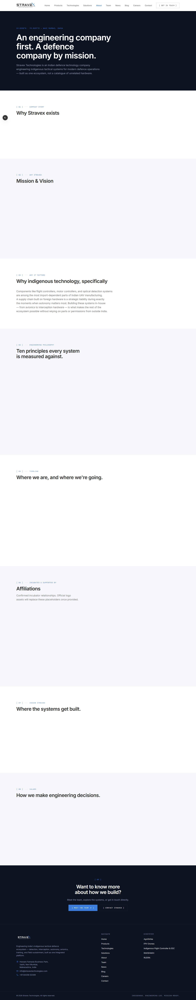 | 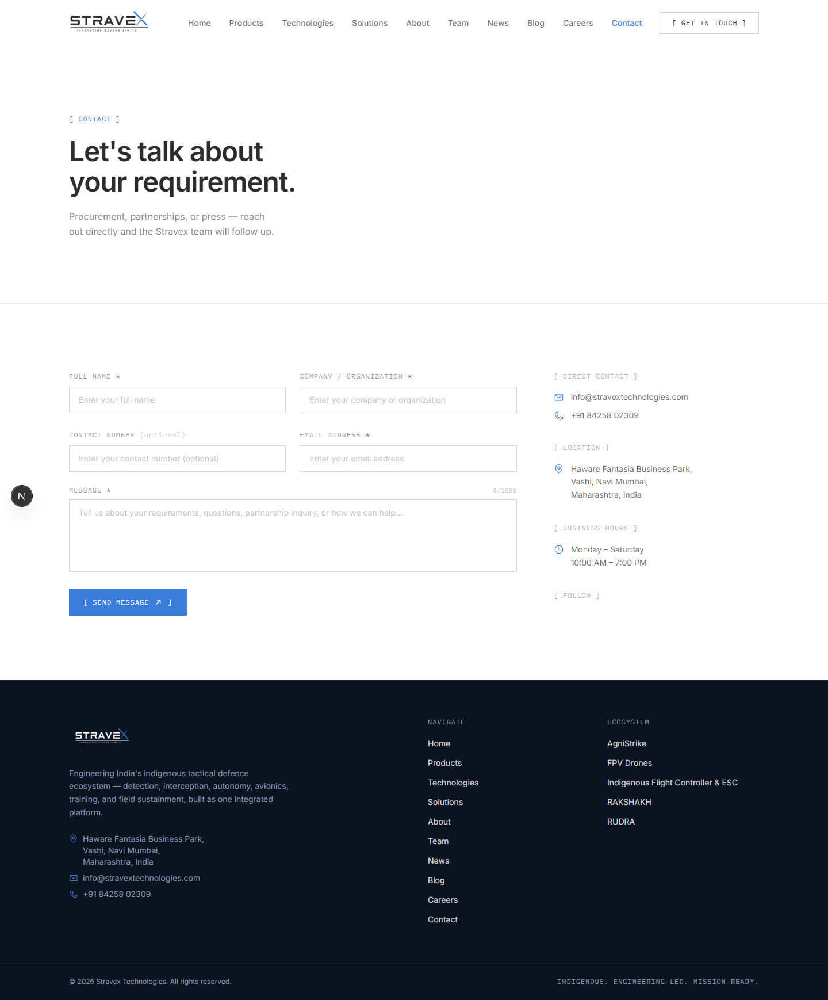 |

| Blog | News |
| :---: | :---: |
| 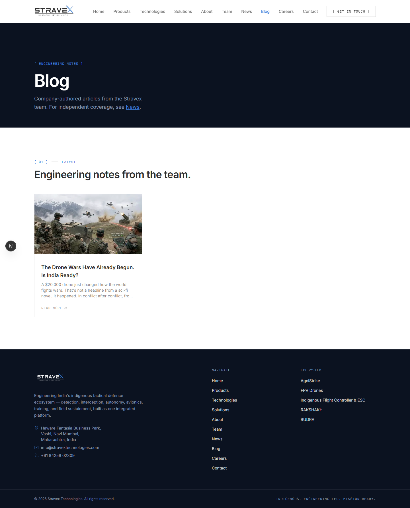 | 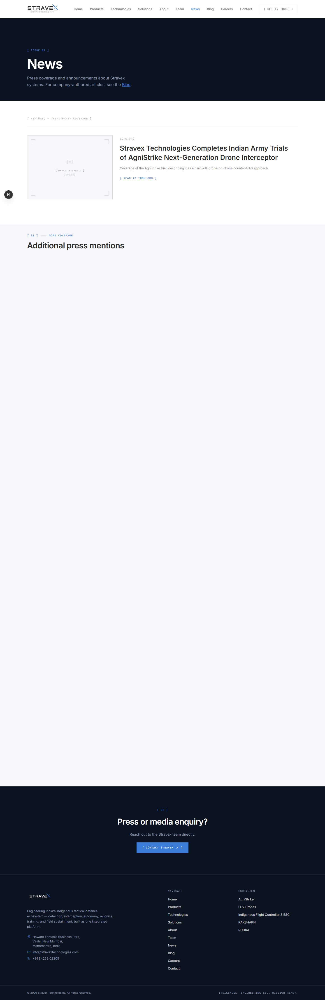 |

| Careers | Team |
| :---: | :---: |
|  | 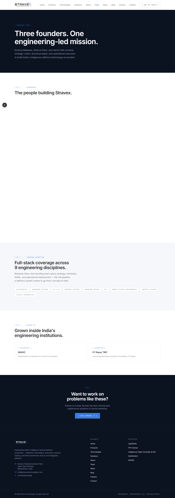 |

| Products | Technologies |
| :---: | :---: |
|  |  |

</details>

<details>
<summary><b>Click to View Admin CMS Dashboard</b></summary>
<br>

| Dashboard | Media Library |
| :---: | :---: |
|  |  |

| Products Manager | Blog Manager |
| :---: | :---: |
|  |  |

| News Manager | SEO Manager |
| :---: | :---: |
| 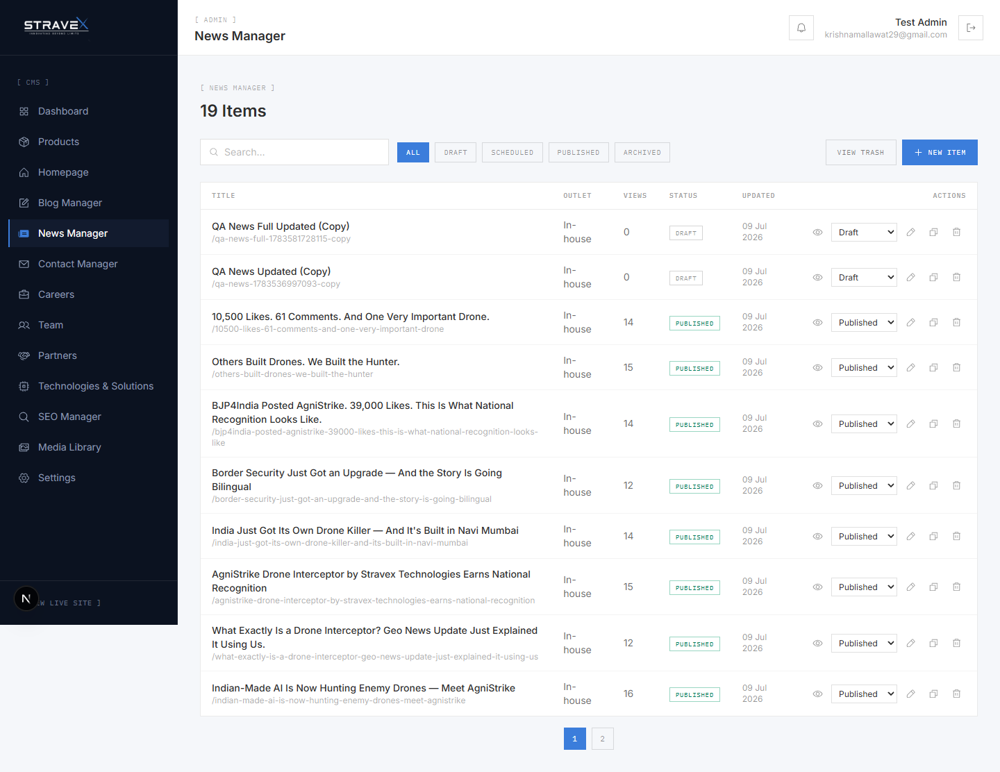 | 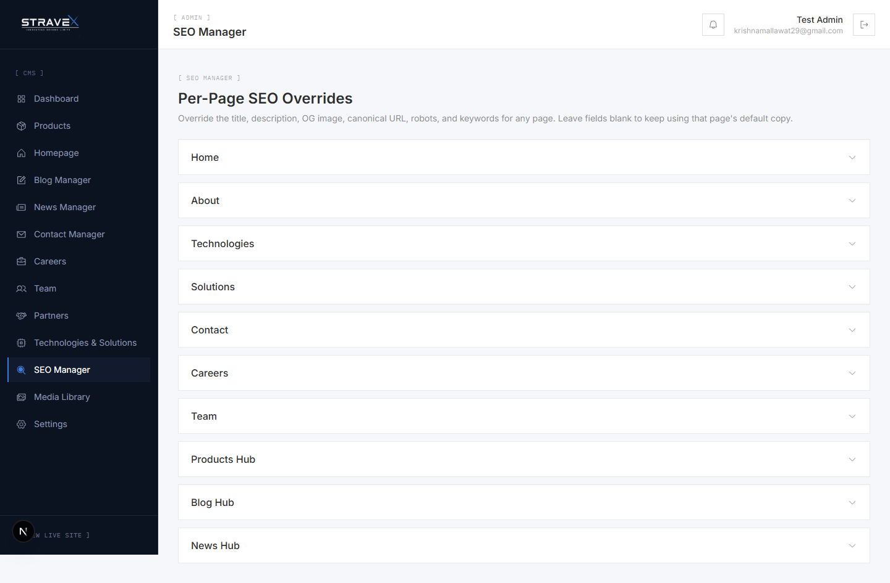 |

| Contact Manager | Settings |
| :---: | :---: |
| 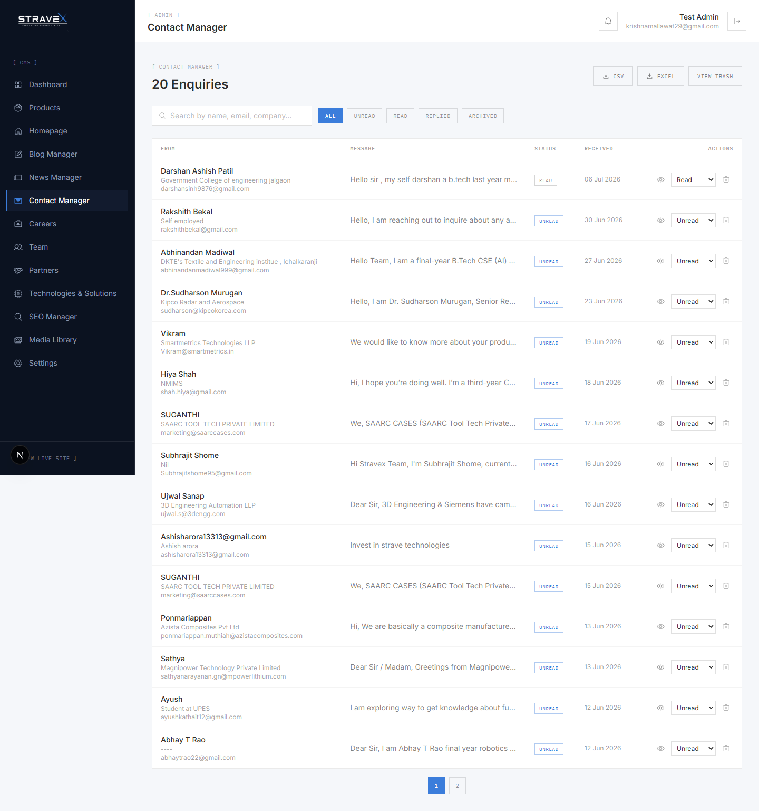 | 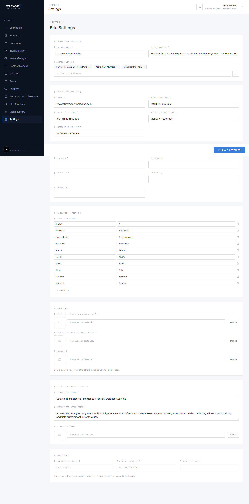 |

| Technologies Manager | Partners Manager |
| :---: | :---: |
| 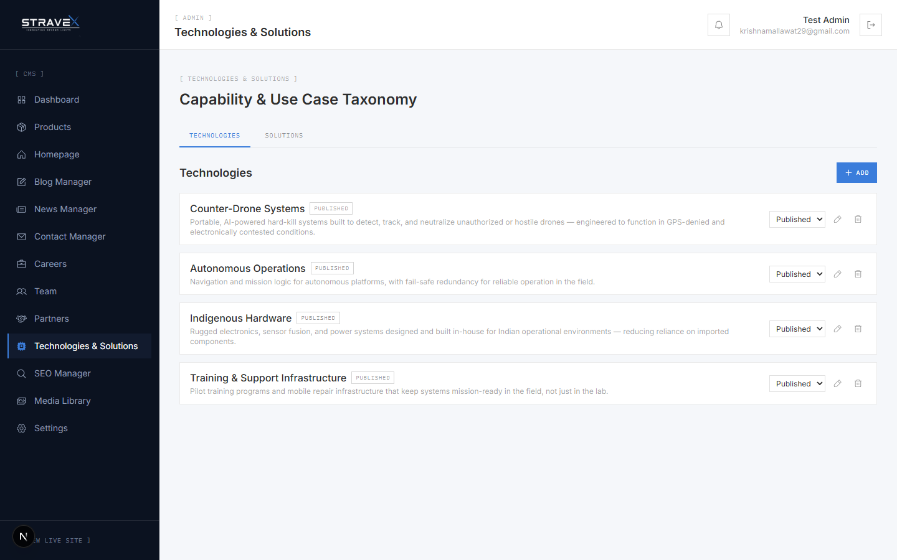 | 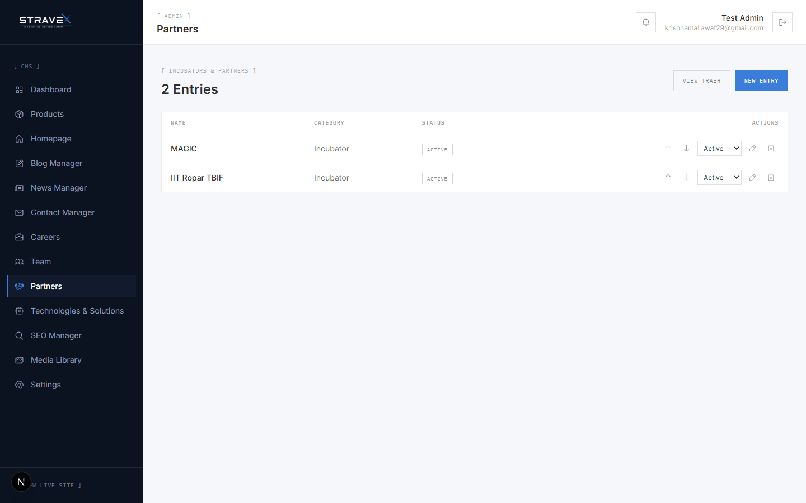 |

</details>

## ✨ Key Features

- 🏗️ **Modern App Router Architecture:** Eliminates traditional REST API routes in favor of native React Server Actions for secure, type-safe data mutations.
- 🗄️ **Relational Database Model:** Prisma ORM provides strict schema validation and complex relational joins across 14+ dedicated CMS modules (Products, Blog, News, Technologies, Solutions, Team, Partners).
- 🔐 **Zero-Trust Admin Authentication:** Powered by Auth.js v5 (NextAuth), utilizing Google OAuth with a strict database-driven email allowlist and HTTP 307 middleware enforcement.
- 🖼️ **Headless Media Library:** Direct-to-Cloudinary image uploading and management, ensuring rapid global CDN delivery without bloating the application server.
- 📈 **Dynamic SEO Manager:** Centralized, database-driven SEO metadata dynamically injected into all public routes for perfect Lighthouse SEO and Accessibility scores.
- 🧭 **Graphify Knowledge Graphs:** The entire repository was mapped using AI-driven Graphify architectural mapping to ensure isolated bug fixes and zero unintended regressions.
- 🚀 **Hostinger & VPS Ready:** Pre-configured for deployment on standard Node.js shared hosting, VPS (PM2/Nginx), or Dockerized environments.

## 📚 Documentation Directory

Deep dive into the engineering behind the platform:

- 🏛️ **[Architecture Overview](docs/architecture/)**: System diagrams, authentication flows, and RSC data patterns.
- 🔌 **[API & Server Actions](docs/api/)**: How we bypassed traditional REST APIs for end-to-end type safety.
- 🗃️ **[Database Design](docs/database/)**: Prisma schemas and relational strategies.
- 🚀 **[Deployment Guides](docs/deployment/)**: Step-by-step CI/CD and deployment runbooks for Hostinger and VPS.
- 📊 **[Audit Reports](docs/reports/)**: Comprehensive QA, Security, and Performance audits.
- 💻 **[Development Guide](docs/development/)**: Local setup and contributor workflows.

## 🛠️ Local Setup

1. **Clone the repository:**
   ```bash
   git clone https://github.com/your-username/stravex-website.git
   cd stravex-website
   ```

2. **Install dependencies:**
   ```bash
   npm install
   ```

3. **Configure Environment:**
   Copy the example environment file and fill in your credentials.
   ```bash
   cp .env.example .env
   ```

4. **Initialize the Database:**
   ```bash
   npx prisma db push
   npx prisma db seed
   ```

5. **Start the Development Server:**
   ```bash
   npm run dev
   ```
   *Visit `http://localhost:3000` for the public site, and `http://localhost:3000/admin` for the dashboard.*

## 🔒 Security & License

This project is proprietary software developed by **Keshav Mallawat**. 

**License:** All Rights Reserved. This repository is provided solely as a professional portfolio demonstration. Commercial use, reproduction, or redistribution is strictly prohibited.

For security disclosures or professional inquiries, please refer to the [Security Policy](SECURITY.md) or contact `mallawatkeshav@gmail.com`.

---
<div align="center">
  <i>Architected with ❤️ for the Modern Web.</i>
</div>
