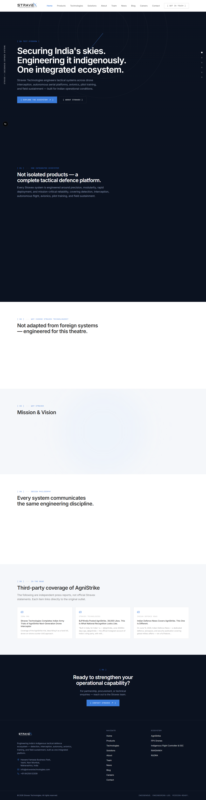
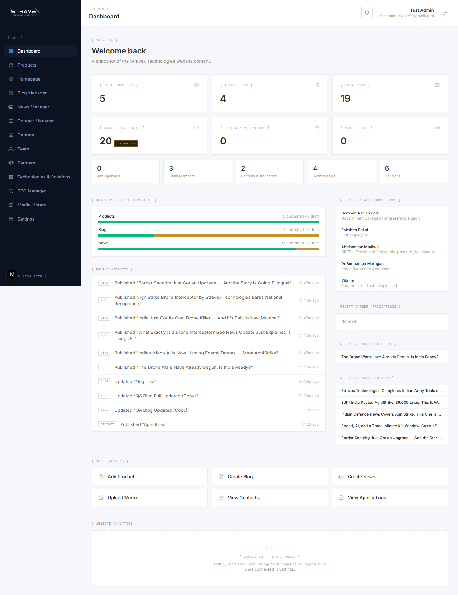
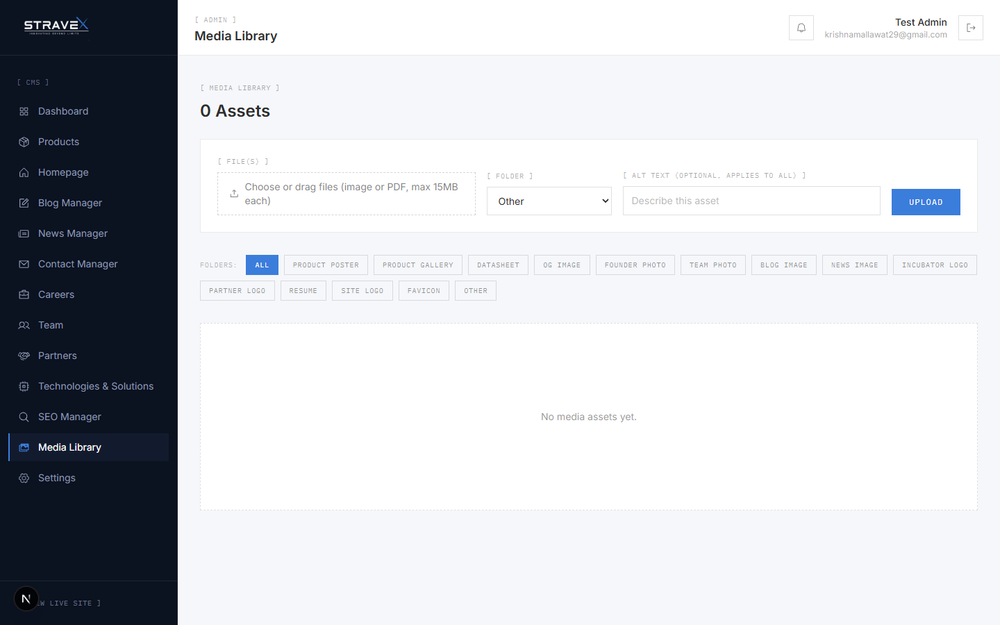
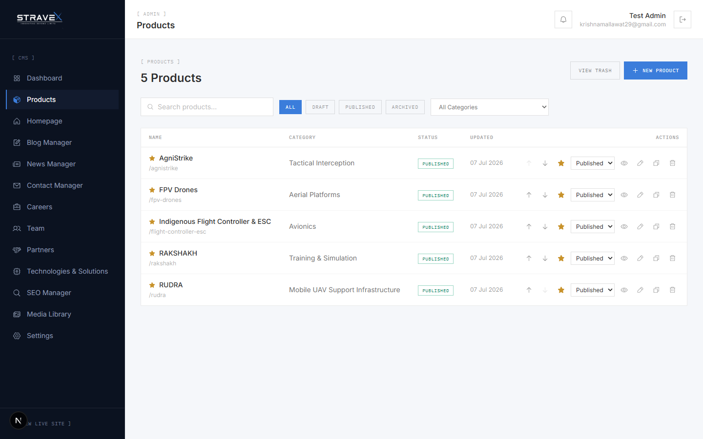
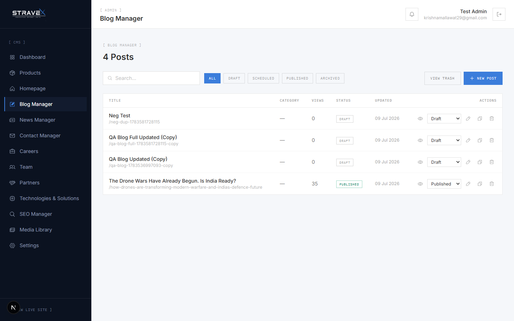
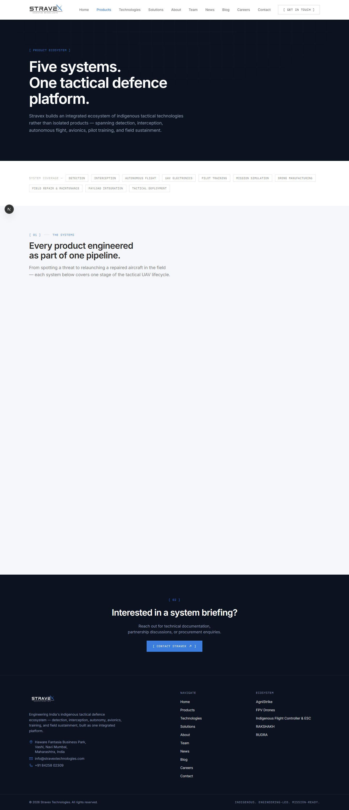
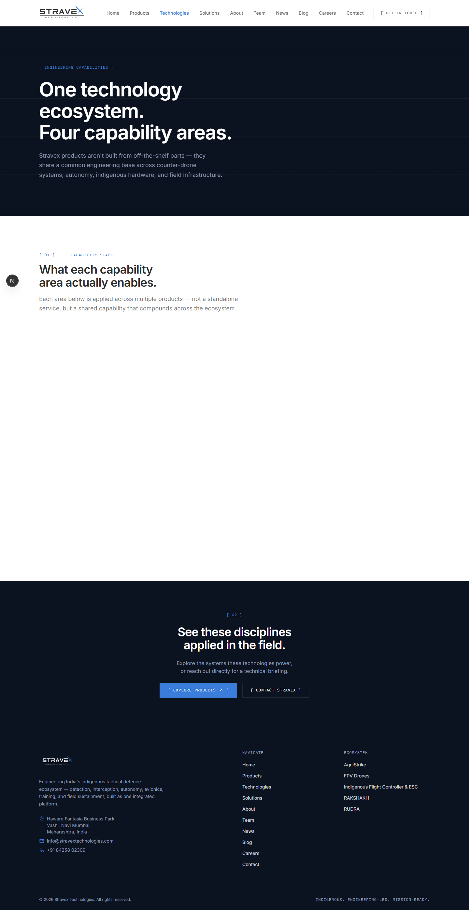
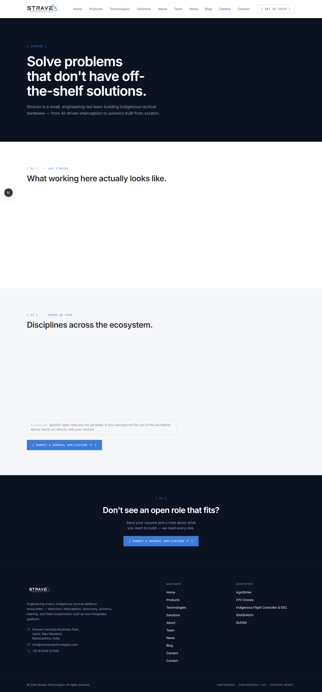
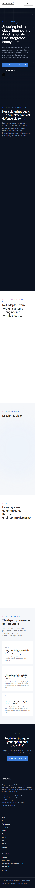

<div align="center">
  

  <h1>Stravex Technologies CMS</h1>

  <p>A Next.js 16 corporate website with a Prisma-backed admin CMS, Google sign-in restricted to an allowlist, and a Cloudinary media library.</p>

  <p>
    
    
    
    
  </p>
</div>

---

## Overview

This is the second generation of the Stravex Technologies website. It replaces the earlier React + Firebase single-page app ([Stravex_Technologies](https://github.com/keshavmallawat/Stravex_Technologies)) with a server-rendered Next.js application and a relational data model.

The public site (products, solutions, technologies, team, careers, news, blog, contact) is rendered from content that the Stravex team manages through an admin dashboard at `/admin`, with no code changes needed to publish.

## Features

- **Server-rendered public site** built on the Next.js App Router, with a generated sitemap and robots file.
- **Admin dashboard** for products, solutions, technologies, team, partners, blog, news, careers, contacts, homepage sections, SEO and site settings.
- **Mutations through Server Actions**, so there is no hand-written REST layer to maintain.
- **Auth.js v5 with Google OAuth.** Only emails on the admin allowlist can sign in, and the request proxy redirects everyone else.
- **Media library** with direct Cloudinary uploads and deletion.
- **Rich-text editing** for blog and news posts with Tiptap.
- **Per-page SEO manager** (titles and descriptions) stored in the database.
- **Careers pipeline**: job openings, applications and status tracking.
- **Contact inbox** with notifications and spreadsheet export.

## Tech stack

| Area | Choice |
| --- | --- |
| Framework | Next.js 16 (App Router, React Server Components, Server Actions), React 19 |
| Language | TypeScript |
| Data | Prisma 7 with SQLite (better-sqlite3 adapter); the schema is portable to PostgreSQL by changing the provider and `DATABASE_URL` |
| Auth | Auth.js (NextAuth v5), Google OAuth, database-backed email allowlist |
| Media | Cloudinary |
| Styling and UI | Tailwind CSS 4, Framer Motion, Phosphor Icons |
| Editor | Tiptap |

## Getting started

Requirements: Node.js 20 or newer and a Google OAuth client (for admin sign-in).

```bash
git clone https://github.com/keshavmallawat/stravex-technologies.git
cd stravex-technologies
npm install
cp .env.example .env     # then fill in the values
npx prisma db push
npx prisma db seed
npm run dev
```

The public site runs at `http://localhost:3000` and the dashboard at `http://localhost:3000/admin`.

### Environment variables

| Variable | Purpose |
| --- | --- |
| `DATABASE_URL` | Prisma connection string, for example `file:./dev.db` |
| `AUTH_SECRET` | Session signing secret (generate with `npx auth secret`) |
| `AUTH_URL`, `AUTH_TRUST_HOST` | Public URL of the deployment (needed outside Vercel) |
| `AUTH_GOOGLE_ID`, `AUTH_GOOGLE_SECRET` | Google OAuth credentials |
| `ADMIN_EMAILS` | Comma-separated emails allowed into `/admin`; run `npx prisma db seed` after changing it |
| `CLOUDINARY_CLOUD_NAME`, `CLOUDINARY_API_KEY`, `CLOUDINARY_API_SECRET` | Media library |

### Scripts

| Command | Description |
| --- | --- |
| `npm run dev` | Start the development server |
| `npm run build` | Production build |
| `npm start` | Serve the production build |
| `npm run lint` | Run ESLint |

## Project structure

```text
src/
  app/
    (site)/        public pages
    admin/         dashboard (login, modules, previews)
    api/           route handlers (auth, contact form, careers, media)
  lib/             data access, Cloudinary, slugs, SEO and shared types
prisma/
  schema.prisma    data model
  seed.ts          admin allowlist and initial content
docs/              architecture, database, deployment runbooks, reports
```

## Documentation

- [Architecture](docs/architecture/README.md)
- [Server Actions and API](docs/api/README.md)
- [Database](docs/database/README.md)
- [Deployment guides](docs/deployment/): Hostinger shared hosting, VPS (PM2 and Nginx) and Docker, plus a go-live checklist and rollback steps
- [Development guide](docs/development/README.md)
- [QA and performance reports](docs/reports/)

## Screenshots

<details>
<summary>Admin dashboard</summary>
<br>

| Dashboard | Media library |
| :---: | :---: |
|  |  |

| Products | Blog |
| :---: | :---: |
|  |  |

</details>

<details>
<summary>Public site</summary>
<br>

| Products | Technologies |
| :---: | :---: |
|  |  |

| Careers | Mobile |
| :---: | :---: |
|  |  |

</details>

## License

Copyright (c) 2026 Keshav Mallawat (Stravex Technologies). All rights reserved. The source is published for review only; see [LICENSE](LICENSE). Security reports: [SECURITY.md](SECURITY.md).
