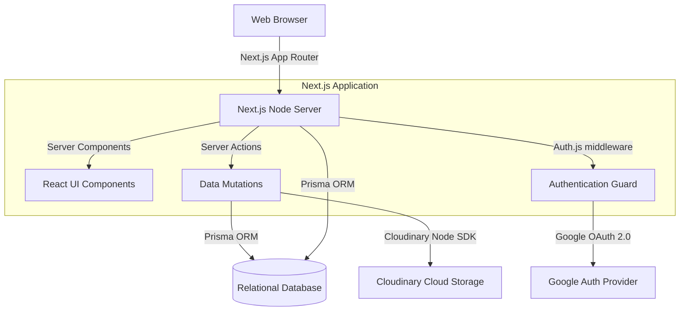

# Architecture Overview

Stravex CMS 2.0 is built on a modern, enterprise-grade Next.js 16 App Router architecture.

## System Diagram

## Authentication Flow
We use **Auth.js v5 (NextAuth)**.
1. The user attempts to access `/admin/*`.
2. Next.js Middleware intercepts the request.
3. If unauthenticated, it returns an HTTP 307 redirect to `/admin/login`.
4. The user logs in via Google OAuth.
5. The callback verifies the user's email against the `ADMIN_EMAILS` allowlist (stored in the database's `User` table).
6. If authorized, a secure HttpOnly session cookie is issued.

## CMS Architecture
The CMS is entirely **headless-ready**, although it currently serves the public frontend directly. Data mutations strictly bypass traditional API routes by utilizing React **Server Actions**. This provides end-to-end type safety between the Prisma database models and the frontend React components.

## SEO Pipeline
SEO is centralized via the `SeoMetadata` Prisma model. Every public dynamic page (Products, Blog, News, etc.) has a 1-to-1 relationship with an SEO record. Next.js `generateMetadata()` securely fetches this record server-side before streaming the HTML to the client, guaranteeing perfect SEO crawler visibility.
